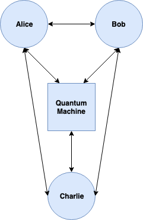

# CS269Q Final Project: Quantum Secret Sharing

This project holds the code for our implemenation of Quantum Secret Sharing. The project has two implementations of quantum secret sharing: a local version in which Alice, Bob, and Charlie manipulate the qubits on the same machine, and a version that relies on a classic network in which Alice, Bob, Charlie, and the quantum machine all live on different servers and share quantum secrets over the network.

## Local Version:

To run the local version of the code, you first must run

```
qvm -S
```
Now, you can simply run

```
./secret_sharing.py <alpha_1>,<beta_1> <alpha_2>,<beta_2>
```

Here, we are assuming that Alice only has two qubits to send. If she has more, she can keep appending to the command.

## Network Version:



First, you must run

```
qvm -S
```

Then, you run the next commands each in their own window:

```
./quantum_comp.py
```

```
./alice.py
```

```
./bob.py
```

```
./charlie.py
```

In the Alice window, it will first ask you for the alpha and beta you want to send:
```
What's the alpha you want to send?
What's the beta you want to send?
```

After you enter in your desired values, it will then continuously prompt you for the next command like this:
```
Next command>
```

If you want to do quantum secret sharing, then your next commands should be this (assuming that you want Charlie to end up with the message):
```
measure_bell_basis
tell_bob_to_measure
tell_charlie_to_reconstruct
tell_bob_to_send_to_charlie
```

Now, in the Charlie screen, you should see the reconstructed wave function.

To have Bob have the final message, you merely have to switch the last three of the commands above to use charlie's name where bob's is and bob's name where charlie's is.
